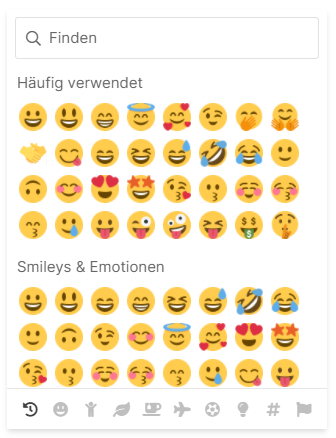

<h1 align="center">chayns-emoji-picker</h1>
<p align="center">
    <strong>An emoji-picker for use within chayns® applications built with React.</strong>
</p>
<p align="center">
    <a href="https://github.com/tobitsoftware/chayns-emoji-picker/blob/main/LICENSE">
        
    </a>
    <a href="https://www.npmjs.com/package/chayns-emoji-picker/">
        
    </a>
    <a href="https://github.com/tobitsoftware/chayns-emoji-picker/issues">
        
    </a>
</p>
<p align="center">
    <a href="#-get-started"><b>Get Started</b></a>
    <span>  •  </span>
    <a href="#-documentation"><b>Documentation</b></a>
    <span>  •  </span>
    <a href="#-contributing"><b>Contributing</b></a>
</p>

---

`chayns-emoji-picker` is a fully-featured and accessible emoji-picker for
chayns® applications. It is built and meant to be used with React.

<p align="center">
     
</p>

## ❯ Get Started

First off, install the package:

```bash
# Yarn
yarn add chayns-emoji-picker

# NPM
npm install chayns-emoji-picker
```

Now, you can import the `<EmojiPicker>` component into your components:

```tsx
import React, { ReactElement } from 'react';
import { EmojiPicker } from 'chayns-emoji-picker';

export function MyComponent() {
    const [showEmojiPicker, setShowEmojiPicker] = useState(false);

    function handleOpenEmojiPicker() {
        setShowEmojiPicker(true);
    }

    function handleCloseEmojiPicker() {
        setShowEmojiPicker(false);
    }

    return (
        <button
            style={{ position: 'relative' }}
            onClick={handleOpenEmojiPicker}
        >
            Show Emoji-Picker
            <EmojiPicker
                show={showEmojiPicker}
                onHide={handleCloseEmojiPicker}
            />
        </button>
    );
}
```

For a full reference and documentation of all props, visit the
[docs](tobitsoftware.github.io/chayns-emoji-picker/).

<br />

## ❯ Documentation

Visit
[tobitsoftware.github.io/chayns-emoji-picker/](https://tobitsoftware.github.io/chayns-emoji-picker/)
to read the full documentation.

<br />

## ❯ Contributing

You can find information about contributing to the project in our
[CONTRIBUTING.md](./CONTRIBUTING.md) document.
